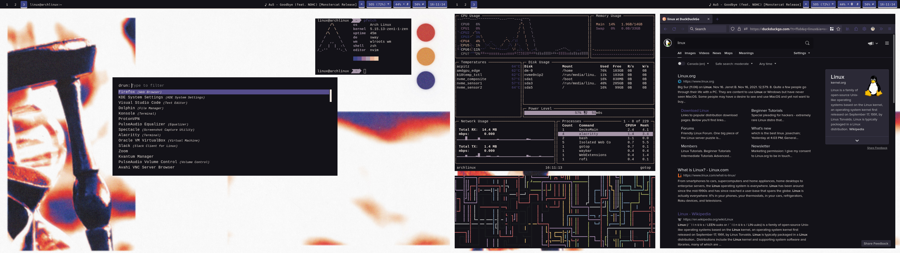
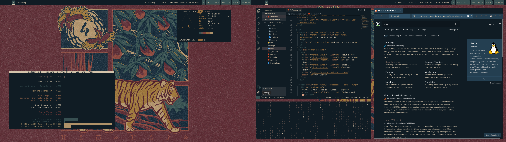
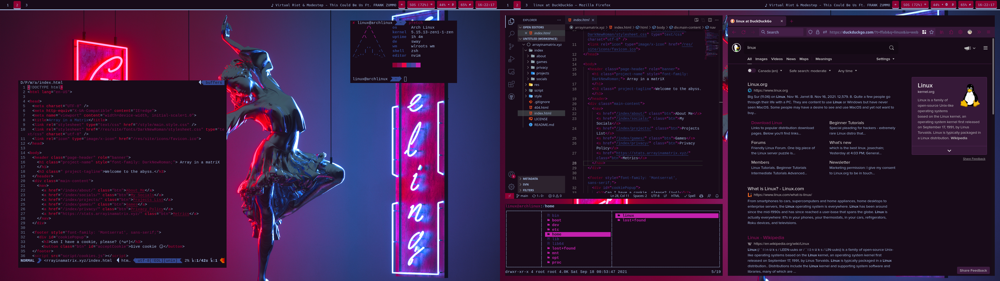
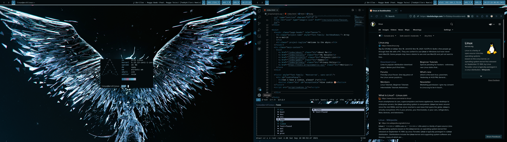
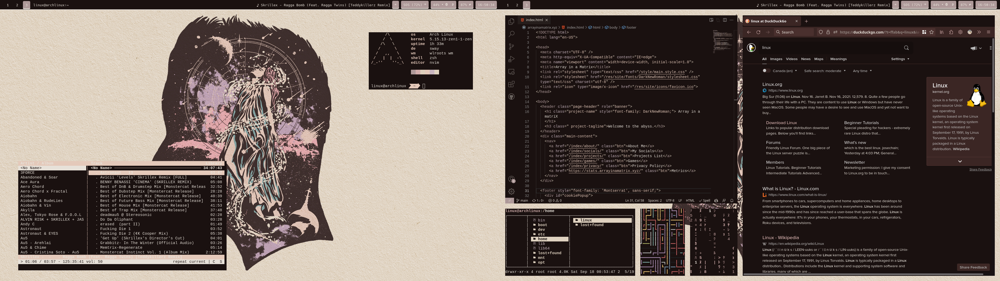
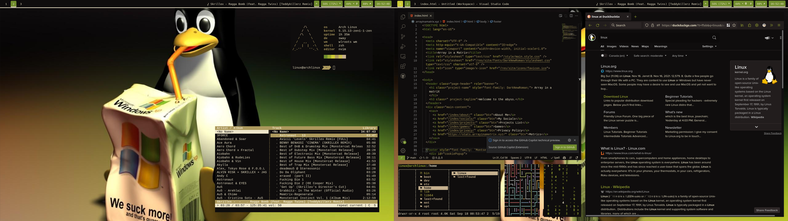
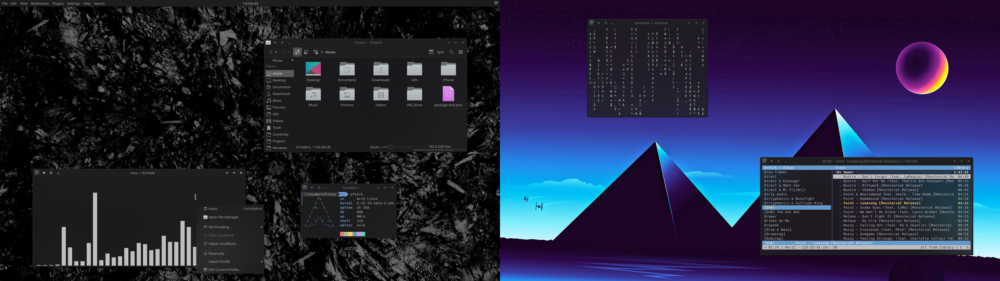
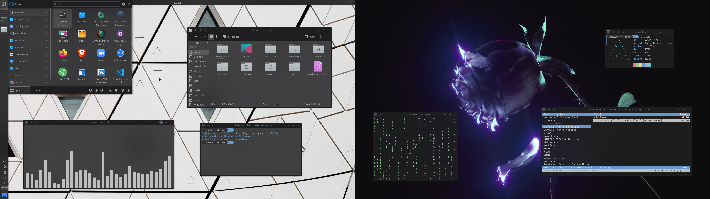

# Dotfiles

I use 2 DE/WM on my Arch Linux system:
   - KDE/kwin
   - SwayWM/wlroots

I also use `lightDM` as my display manager.

## SwayWM
- Terminal: `Alacritty`
- File Manager: `LF`
- Bar: `Waybar`
- Launcher: `Rofi`

## KDE
- Terminal: `Konsole`
- File Manager: `Dolphin`

## Other Apps
    - pywal
    - unimatrix
    - pywal
    - pipes.sh
    - pfetch
    - gotop
    - cava
    - cmus
    - neovim
    - firefox
    - vscode
    - zsh
    - radeontop
    - lsd

## Sway

  

## KDE

